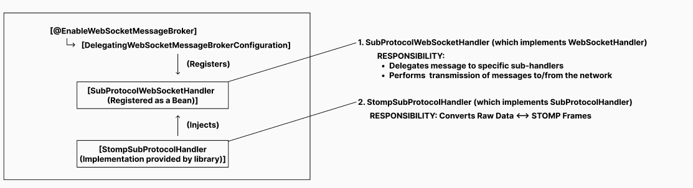

# STOMP Explained
STOMP (Streaming Text Oriented Messaging Protocol) is a protocol that operates over WebSocket. It provides a structured message template and powerful features like a topic-based pub/sub system. By adopting STOMP, we can avoid the complexity of designing a custom messaging sub-protocol, as raw WebSocket do not define specific communication rules.

# Spring Integration
### Overivew

We can apply a sub-protocol within Spring WebSocket API by Implementing the SubProtocolHandler interface, which is then utilized by the SubProtocolWebSocketHandler(which extends WebSocketHandler) and has responsibility to meet standards of protocal.

### What is WebSocketHandler
In Spring WebSocket API architecture, we need to implement WebSocketHandler and manually register it via WebSocketConfigurer(if you use WebSocket API without STOMP, there are also some WebSocketHandler implementation Spring WebSocket API provides such as TextWebSocketHandler so that you can extend and override easily).

However, you might notice that SubProtocolWebSocketHandler is not explicitly registered in my WebSocketConfig.java. This is because the @EnableWebSocketMessageBroker annotation imports DelegatingWebSocketMessageBrokerConfiguration (which extends WebSocketMessageBrokerConfigurationSupport).

This configuration automatically registers SubProtocolWebSocketHandler as a bean. Simultaneously, the STOMP library provides a concrete implementation of SubProtocolHandler, which is injected into the SubProtocolWebSocketHandler. This seamless integration is how Spring manages the STOMP protocol on top of its raw WebSocket API.

### The key takeaway
The key takeaway is that we no longer need to worry about manually converting raw WebSocket data into STOMP frames. That responsibility lies entirely with the StompSubProtocolHandler (an implementation of SubProtocolHandler). By offloading this low-level complexity to the framework, we can shift our focus toward mastering the features STOMP offers and effectively utilizing the library to build our application.

However, you should have a solid understanding of the Spring WebSocket API as well. I've implemented it to handle session switching when a user changes their device. I will take a note for you.